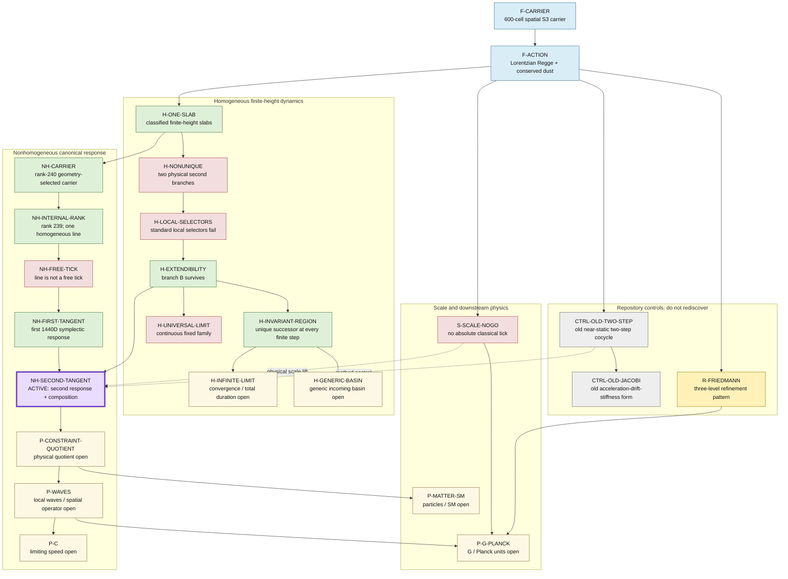

# Authoritative theory map

Updated: 2026-08-22

This is the navigation and duplication-control map for the active public
600-cell Regge programme.  It is not a promotional summary.  Every route has
a complete scope in [`theory_map.json`](theory_map.json), including its
hypotheses, evidence, dependencies, search aliases and, for a bounded no-go,
the condition required to reopen it.

Read this file, [`gravity/CURRENT_STATUS.md`](gravity/CURRENT_STATUS.md) and
the binding [`../CLAUDE.md`](../CLAUDE.md) before starting a calculation.

## How to use the map

Before a new calculation:

1. formulate the proposed object, carrier, operator and hypotheses;
2. search `theory_map.json` using all technical aliases of that object;
3. search the referenced result notes and verifier names before treating the
   route as new;
4. classify the proposal as an existing result, a reusable control, a
   genuinely open gate or a route already closed under the same hypotheses;
5. only then perform the literature gate and preregister a new test;
6. keep exactly one route marked `ACTIVE_GATE`;
7. when the result is consolidated, update this map and the JSON registry in
   the same commit.

Absence from this map is not evidence of novelty.  It means the repository
search must be widened before a new route is authorized.

The scientific label and route state answer different questions:

- `DERIVED`, `STRUCTURAL`, `PATTERN`, `OPEN` say how strong the evidence is;
- `ACCEPTED`, `BOUNDED_NO_GO`, `OPEN_GATE`, `ACTIVE_GATE`, `METHOD_CONTROL`
  and `PATTERN_CONTROL` say what to do with the route next.

A `BOUNDED_NO_GO` is never an unrestricted impossibility claim.  Its exact
kill scope and reopening condition are in the JSON registry.

## Main map



The red nodes are bounded negatives, not failed projects.  They tell us
which exact argument must not be rerun under unchanged hypotheses.  The
purple node is the only active calculation.

## Route ledger

| Route ID | Evidence label | Route state | Current statement | Primary evidence |
|---|---|---|---|---|
| `F-CARRIER` | STRUCTURAL | FOUNDATION | Fixed regular 600-cell spatial `S^3` carrier, f-vector `(120,720,1200,600)` | [face-poset result](gravity/gravity_600cell_overlay_face_poset_result.md) |
| `F-ACTION` | DERIVED | FOUNDATION | Reproducible zero-`Lambda` Lorentzian Regge-plus-dust slab action | [published-action control](gravity/gravity_600cell_published_dust_control_result.md) |
| `H-ONE-SLAB` | DERIVED | ACCEPTED | Nonzero positive-height one-slab roots are exactly classified in the homogeneous sector | [classification](gravity/gravity_600cell_finite_height_classification_result.md) |
| `H-NONUNIQUE` | DERIVED | BOUNDED_NO_GO | At `v=3/2`, the action alone gives two physical second slabs | [composition result](gravity/gravity_600cell_finite_height_composition_result.md) |
| `H-LOCAL-SELECTORS` | DERIVED | BOUNDED_NO_GO | Causality, orientation, real branch and local regularity do not select between them | [selector audit](gravity/gravity_600cell_finite_height_selector_result.md) |
| `H-EXTENDIBILITY` | STRUCTURAL | ACCEPTED | Branch A dies; branch B has the accepted third, fourth and fifth continuations | [third-slab result](gravity/gravity_600cell_finite_height_third_slab_result.md) |
| `H-INVARIANT-REGION` | DERIVED | ACCEPTED | The accepted branch has one successor at every prescribed finite step | [invariant-region theorem](gravity/gravity_600cell_finite_height_invariant_region_result.md) |
| `H-INFINITE-LIMIT` | OPEN | OPEN_GATE | Convergence, infinite total proper duration and completeness are not proved | [invariant-region limits](gravity/gravity_600cell_finite_height_invariant_region_result.md) |
| `H-UNIVERSAL-LIMIT` | DERIVED | BOUNDED_NO_GO | The compactified boundary contains a continuous fixed family, not one universal endpoint | [asymptotic map](gravity/gravity_600cell_finite_height_asymptotic_map_result.md) |
| `H-GENERIC-BASIN` | OPEN | OPEN_GATE | The finite census has 36 signatures; only a local neighbourhood of the representative tree is certified | [basin census](gravity/gravity_600cell_finite_height_incoming_basin_discovery_result.md) |
| `NH-CARRIER` | STRUCTURAL | ACCEPTED | A geometry-selected rank-240 scale-plus-strut tangent carrier survives the canonicity audit | [quadratic carrier](gravity/gravity_600cell_finite_height_carrier_quadratic_result.md) |
| `NH-INTERNAL-RANK` | DERIVED | ACCEPTED | Internal stationarity has rank 239 and kills every nonhomogeneous carrier direction | [rank result](gravity/gravity_600cell_finite_height_internal_carrier_rank_result.md) |
| `NH-FREE-TICK` | DERIVED | BOUNDED_NO_GO | The survivor is the lapse-constraint tangent and fixed incoming momentum removes it | [kernel reconciliation](gravity/gravity_600cell_finite_height_internal_kernel_canonical_reconciliation_result.md) |
| `NH-FIRST-TANGENT` | DERIVED | ACCEPTED | The first accepted slab has an adversarially replicated regular symplectic 1440D forced response | [first full tangent](gravity/gravity_600cell_finite_height_full_boundary_tangent_result.md) |
| `NH-SECOND-TANGENT` | OPEN | ACTIVE_GATE | Test the second finite-height tangent, direct scale lift and all four schedule compositions | [frozen protocol](gravity/gravity_600cell_second_full_boundary_tangent_protocol.md); [history-provenance correction](gravity/gravity_600cell_second_full_boundary_tangent_history_provenance_correction.md); [preserved first failure](gravity/gravity_600cell_second_full_boundary_tangent_first_run_failure.md) |
| `CTRL-OLD-TWO-STEP` | DERIVED | METHOD_CONTROL | Two-step tangent machinery already exists on the old near-static `tau=0.0102` background | [old two-step result](gravity/gravity_600cell_dust_two_step_full_tangent_result.md) |
| `CTRL-OLD-JACOBI` | DERIVED | METHOD_CONTROL | Three-slice acceleration-drift-stiffness machinery already exists on that old background | [old Jacobi result](gravity/gravity_600cell_dust_three_slice_jacobi_result.md) |
| `R-FRIEDMANN` | PATTERN | PATTERN_CONTROL | Three refinement levels approach the homogeneous Friedmann acceleration; no convergence theorem | [refinement comparison](gravity/gravity_600cell_projected_refinement_acceleration_comparison_result.md) |
| `S-SCALE-NOGO` | DERIVED | BOUNDED_NO_GO | The scale-covariant classical action cannot select an absolute nonzero tick | [scale-covariance theorem](gravity/gravity_600cell_tick_scale_covariance_result.md) |
| `P-CONSTRAINT-QUOTIENT` | OPEN | OPEN_GATE | A physical constraint/pseudo-constraint quotient is still missing | [first tangent limits](gravity/gravity_600cell_finite_height_full_boundary_tangent_result.md) |
| `P-WAVES` | OPEN | OPEN_GATE | No physical graviton, wave equation or spatial tensor operator is derived | [old Jacobi firewall](gravity/gravity_600cell_dust_three_slice_jacobi_result.md) |
| `P-C` | OPEN | OPEN_GATE | No effective limiting speed is derived | [scale and Jacobi limits](gravity/gravity_600cell_tick_scale_covariance_result.md) |
| `P-G-PLANCK` | OPEN | OPEN_GATE | `G` and Planck units require both physical local dynamics and independently derived scale breaking | [scale no-go](gravity/gravity_600cell_tick_scale_covariance_result.md) |
| `P-MATTER-SM` | OPEN | OPEN_GATE | No particles, masses, gauge algebra or Standard-Model sector are derived in the active public theory | [repository scope](../README.md) |

## No-go ledger and reopening rules

| Route | Closed claim under the stated hypotheses | What would legitimately reopen it |
|---|---|---|
| `H-NONUNIQUE` | The frozen homogeneous action plus its existing physical inequalities defines a unique second tick | An independently motivated selector, or a proof that nonhomogeneous/refined equations remove the ambiguity |
| `H-LOCAL-SELECTORS` | The four tested local conditions select branch A or B | A different preregistered physical selector; do not rerun the same four tests |
| `H-UNIVERSAL-LIMIT` | The current compactified map selects one universal scale ratio | A separately derived condition that breaks the continuous fixed family |
| `NH-FREE-TICK` | The rank-239 internal kernel line is a free mode or a tick | A different, derived physical carrier or boundary-data problem; not a relabelling of this line |
| `S-SCALE-NOGO` | The current scale-free classical action derives seconds, a Planck length or an absolute tick | An independently derived dimensionful scale-breaking input; inserting a measured target after inspection is fitting |

## Current decision path

The only active route is `NH-SECOND-TANGENT`.  Its result has three honest
outcomes:

- if the second pre-Legendre system is singular, or the direct physical and
  normalized assemblies violate the exact scale lift, this finite-height
  two-step tangent route is blocked at the second slab;
- if either staircase schedule changes the tangent or any of the four
  composed maps outside the frozen uncertainty classifier, the proposed
  geometry-independent response is refuted or remains open;
- if all frozen gates pass and a mechanically different replication agrees,
  the next route is `P-CONSTRAINT-QUOTIENT`, followed by a finite-height
  version of the already repository-known `CTRL-OLD-JACOBI` machinery.

Even a pass would not yet be a graviton, a value of `c`, a physical tick or
local general relativity.

## Update invariant

The machine verifier requires:

- unique route IDs and exactly one `ACTIVE_GATE`;
- valid evidence labels and route states;
- existing evidence files and valid dependency IDs;
- no dependency cycle;
- hypotheses, scope and duplicate-search terms for every route;
- kill scopes and reopening conditions for every bounded no-go;
- a next test for every open or active gate;
- every route ID to occur in this Markdown map;
- links to this map from the curated repository indexes and binding rules;
- exactly one registry entry for the map verifier.

Run only:

```bash
/home/razvan/science/.venv/bin/python reproducible/verify_theory_map.py
```

This governance verifier does not run any scientific calculation.
